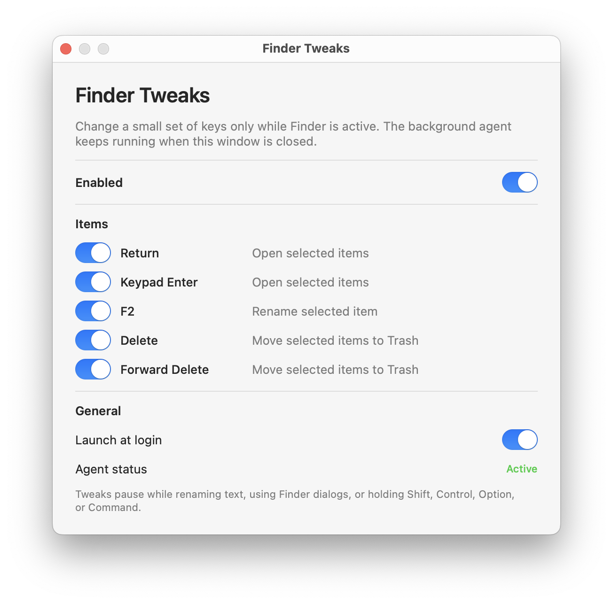

# Finder Tweaks

Finder Tweaks gives Finder a small set of fixed, Windows-style keyboard behaviors without installing a virtual keyboard or a system extension.



## Mappings

| Key | Finder action |
| --- | --- |
| Return | Open selected items |
| Keypad Enter | Open selected items |
| F2 | Rename selected item |
| Delete | Move selected items to Trash |
| Forward Delete | Move selected items to Trash |

Each mapping can be switched off independently. The master switch stops and terminates the background agent. Closing or quitting the settings app leaves the agent running.

The agent listens only to events routed to Finder. It also requires the system-wide focused element to belong to Finder, so non-activating panels such as Spotlight, Raycast, and Alfred keep control of their keyboard input. Mapped keys are ignored while a text field or Finder dialog has focus, and while Shift, Control, Option, or Command is held.

## Build

Requirements:

- macOS 13 or later
- Xcode 16 or later

Build and package the app:

```sh
./Scripts/build-app.sh
```

The result is `.build/product/Finder Tweaks.app`. The script creates an Apple-silicon release build and ad-hoc signs it by default. Pass a signing identity for a stable local or distributable signature:

```sh
SIGN_IDENTITY="Apple Development: Your Name (TEAMID)" ./Scripts/build-app.sh
```

Move the finished app to `/Applications` before enabling launch at login. Finder Tweaks will ask for Accessibility access when its agent starts.

## Privacy

Finder Tweaks has no networking code, analytics, update service, kernel extension, driver, or virtual HID device. The background agent uses a process-specific Core Graphics event tap and Accessibility only to avoid acting in text-entry fields and dialogs.
